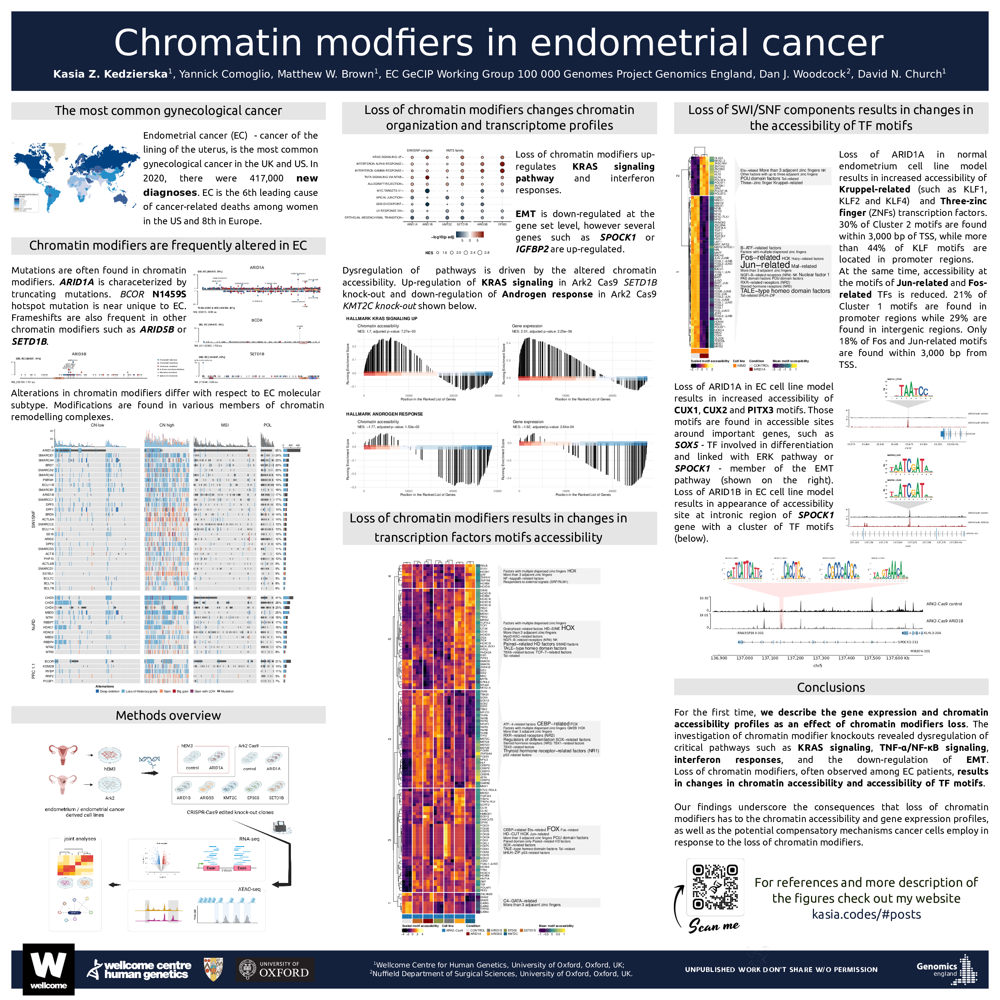
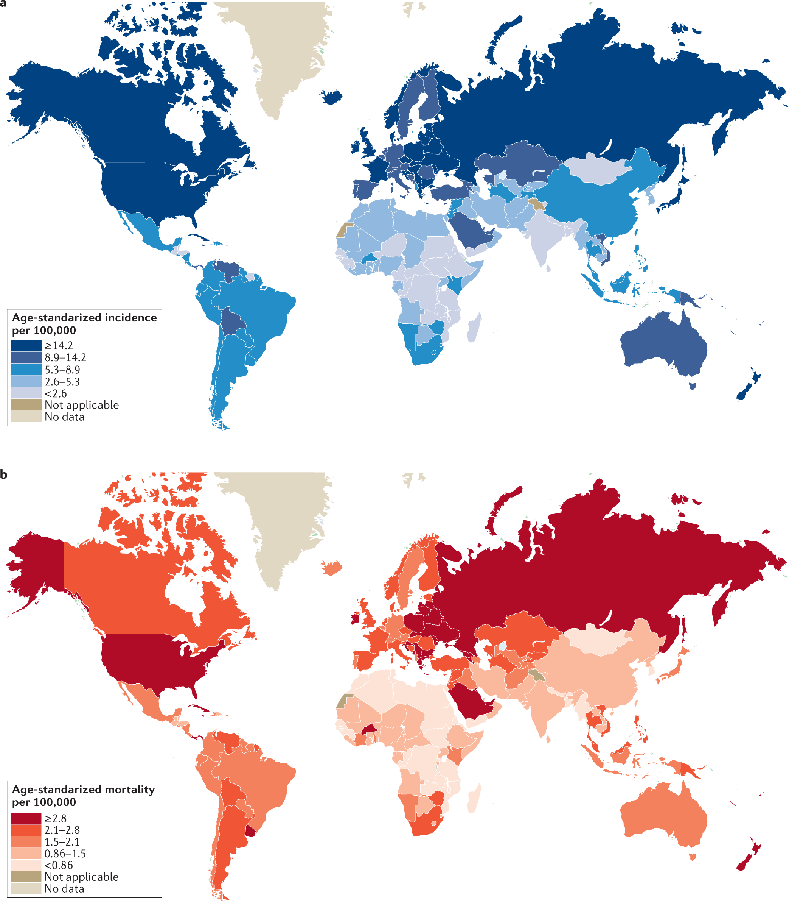
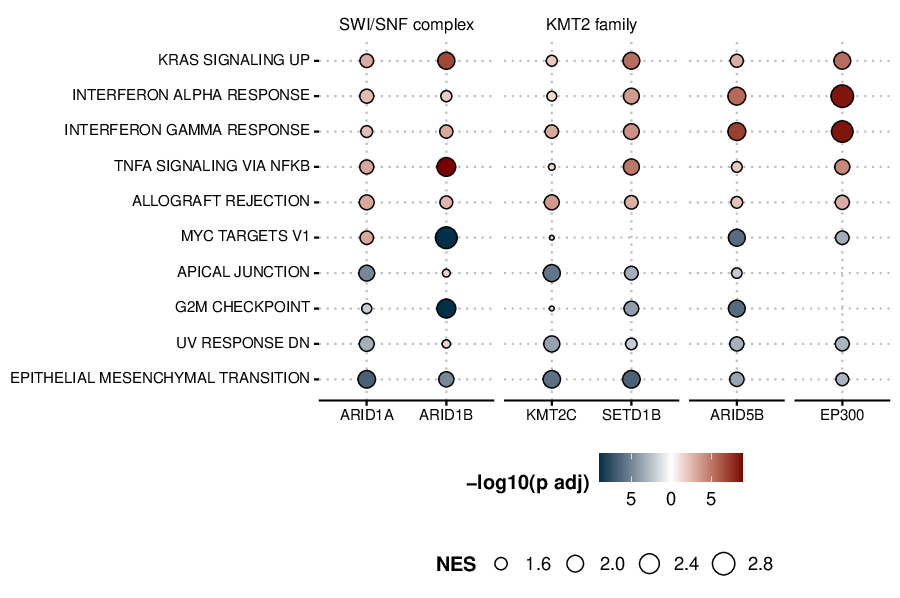
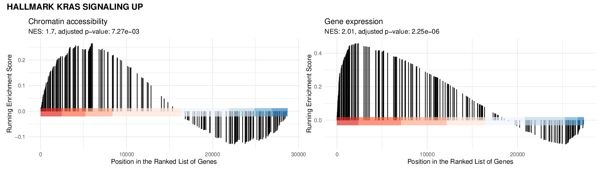
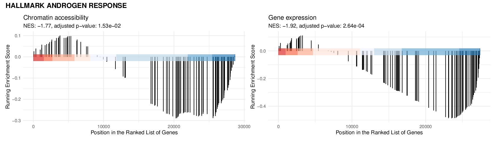
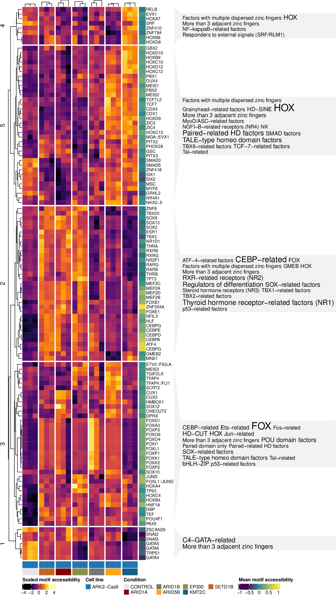
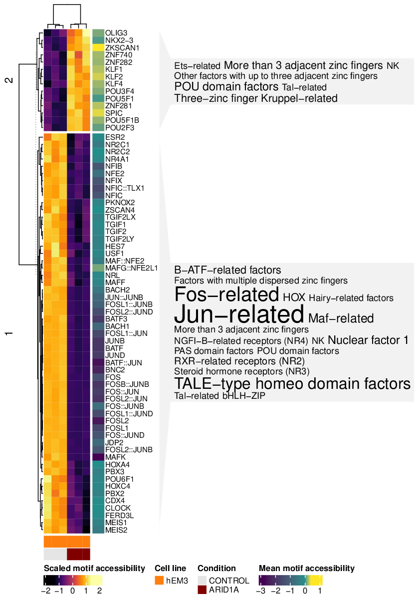
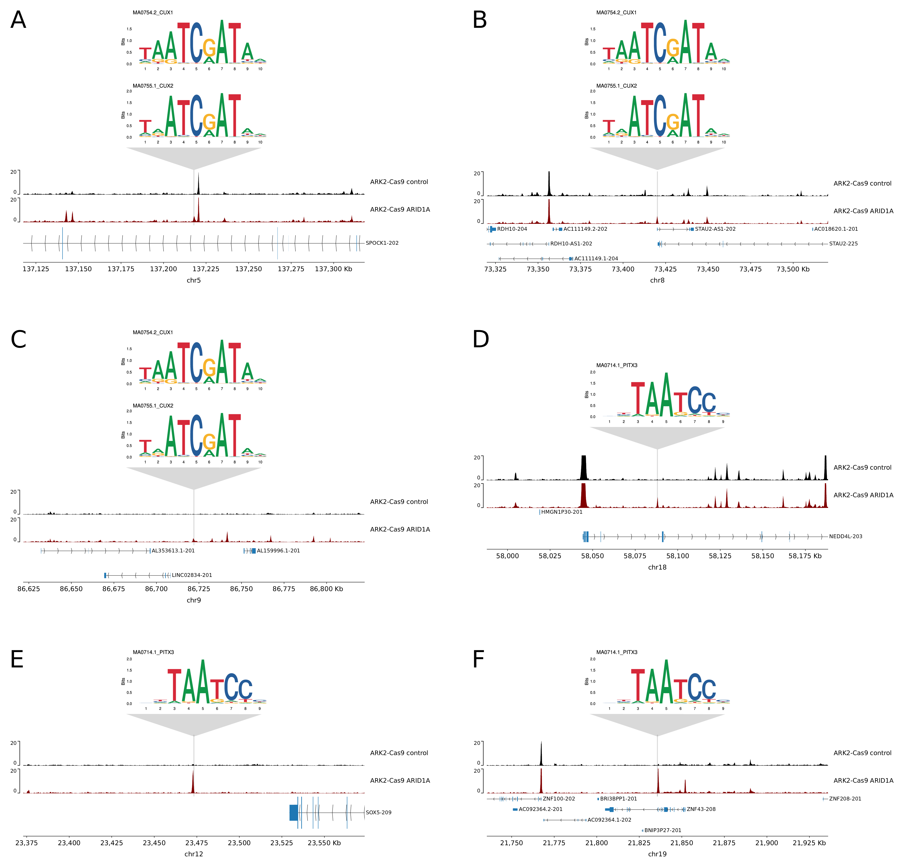
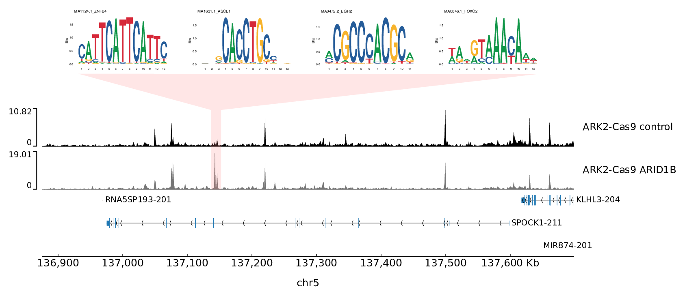
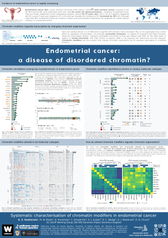

References and more information related to presented posters or scientific talks.

# **Chromatin modfiers in endometrial cancer** @ BoG23

Poster # 153 presented on May 11th, 2023 at Biology of Genomes 23, Cold Spring Harbor

## Abstract

**Chromatin modfiers in endometrial cancer**

Kasia Z. Kedzierska1, Yannick Comoglio1, Matthew W. Brown1, EC GeCIP Working Group 100 000 Genomes Project Genomics England, Dan J. Woodcock2, David N. Church1

1Wellcome Centre for Human Genetics, University of Oxford, Oxford, UK; 2Nuffield Department of Surgical Sciences, University of Oxford, Oxford, UK.

Chromatin organization, a central regulator of gene expression and cell phenotype, is recurrently dysregulated in cancer. Accumulating evidence suggests that chromatin dysregulation through genomic alteration of its modifiers is particularly common in endometrial cancer (EC); the most common gynecological malignancy and a cause of substantial morbidity and mortality. *ARID1A* - a key component of the SWI/SNF remodeling complex - is one of the most frequently mutated EC drivers, while remodelers, such as *CHD4* and *BCOR*, have also been identified as drivers in EC. However, systematic analysis of alteration in chromatin modifiers and their functional consequences in EC has not been performed. 
We analyzed whole genome sequence (WGS) data from EC in the Genomics England (GEL) 100,000 Genomes Project (n=665) along with WES and RNA-seq from The Cancer Genome Atlas (TCGA) pan-cancer (n=10,295) and EC (UCEC and UCS, n=586) cohorts. Driver analysis of GEL EC by IntOGen identified 15 chromatin modifiers as EC drivers, including known EC drivers such as *ARID1A*, *ARID1B*, *ARID5B*, *CTCF*, and additional pan-cancer drivers *CREBBP*, *SETD1B*, *SETDB1*, and *SMARCA4* new to EC. *ARID1A* mutations are highly over-represented in EC (TCGA EC vs. pan-cancer cohort, Fisher’s Exact Test, Odds ratio=10.53, p-value<2.2e-16), with 40-53% of samples harboring a mutation. Other chromatin modifiers are frequently altered. For example, *BCOR*, a member of the PRC1.1 complex, is mutated in 18% of all EC samples with a recurrent N1459S mutation in 9% of samples near-unique to EC. 
To further investigate the role of chromatin remodelers in EC, we complemented our genomic data with gene editing of normal and malignant endometrial cells by CRISPR-Cas9. We generated chromatin accessibility profiles (ATAC-seq) and RNA-seq data for key chromatin modifiers in the endometrial cancer-derived cell line (Ark2, n=21) and human endometrial epithelial cell line (hEM3, n=6). For example, our analysis reveals that with loss of ARID1A in the EC cancer cell line, genes associated with KRAS signaling are upregulated. In contrast, in the hEM3 cell line, genes related to Epithelial-Mesenchymal Transition are upregulated. We further characterize chromatin accessibility profiles and compare the effects of loss of top chromatin modifiers on accessibility of transcription factor binding, enhancer and transcription start sites.
Alterations in chromatin remodelers are highly recurrent in EC, with approx. two-thirds of cases harboring mutations in at least one gene. Our functional analyses by gene editing and ATAC confirm that EC-associated drivers disrupt cellular processes central to oncogenesis; comprehensive interrogation is currently underway. Our study provides the first systematic correlative and functional analyses of chromatin modifiers in EC and provides new insights into EC biology.

## Figures

### Endometrial cancer - the most common gynecological cancer

Endometrial cancer (EC) incidence and mortality across the world. (a) shows the age-standarized incidence per 100,000 people, (b) age-standarized mortality per 100,000 people. Figure from [1].

### Chromatin modifiers are frequently altered in EC

*Note: The plots in this section come from the GEL dataset - due to privacy concerns I would kindly ask you not to copy and share those without my knowledge. We are working hard on getting the manuscript out and should be able to share those shortly. If you have more interest in this data please reach out, I'd be happy to discuss it further!*

Lollipop plots show the mutations (including frameshift deletions, frameshift insertions, nonsense mutations, in-frame insertions and deletions, missense mutations, splice site mutations) in respective genes. 

*ARID1A* lollipop plot shows comparison between GEL and TCGA cohorts showcasing the advantage of using WGS assay to cover also coding sequences. In GEl, we were able to cover ~350 AA sequence of the protein that are not available in TCGA. In this region we see two frameshift hotspots present in above 5% of samples - A339Lfs\*24/Gfs\*61 and G276Efs\*87.

*BCOR* and *SETD1B* lollipop plots show the two respective hotspots - BCOR N1459S and SETD1B H8Tfs\*27/Pfs\*30/Pfs\*29.

*ARID5B* lollipop plot shows hotspot region with multiple mutations just after the BRIGHT domain.

The oncoprint shows the alterations across members of the three chromatin modifying complexes - SWI/SNF, NuRD, and non-canonical version of PRC 1.1 that includes *BCOR*. I show copy number alterations in blue and red, and mutations in dark grey. Please note how each EC molecular subtype is represented by a different alterations patterns. I would like to point out *ARID1A*, mentioned earlier. Samples of CN high subtype accumulate loss of heterozygosity, MSI and POLE subtypes accumulate. In CN low, a subtype with lower mutation and copy number alteration rates, *ARID1A* contains substantial amount of copy LoH and mutations, and in some cases - both.

### Methods overview

We generated chromatin accessibility profiles (ATAC-seq) and RNA-seq data for key chromatin modifiers in the endometrial cancer-derived cell line (Ark2, n=21) and human endometrial epithelial cell line (hEM3, n=6). We used 3 replicates per condition (i.e. control and the CRISPR-Cas9 engineered cell line). 

Created with [BioRender.com](https://www.biorender.com/).

### Loss of chromatin modifiers changes chromatin organization and transcriptome profiles

In the figure below, I show the results of GSEA analysis [2] (on the Hallmark pathways) of the gene expression across the clones.  Size of the dot correlates with the normalized enrichment score (NES) and the shading correlates with the adjusted p-value. 

The two figures below show the GSEA results for gene expression and the accessibility of the regions linked to genes. Height of the bar signifies the running enrichment score at the gene in the given position in rank. Higher density towards the left of the plot (in the red region) signifies enrichment of the genes at the top of the ranking, i.e. up-regulation of the pathway. 

KRAS signaling in Ark2 Cas9 *SETD1B KO*.

Androgen response in Ark2 Cas9 *KMT2C KO*.

### Loss of chromatin modifiers results in changes in transcription factors motifs accessibility

Heatmap below shows normalized and scaled transcription factor accessibility across all Ark2 Cas9 clones. In dark lower accessibility and in light yellow - higher accessibility shown. Mean accessibility per transcription factor shown on the right of the heatmap.

### Loss of SWI/SNF components results in changes in the accessibility of TF motifs 

Heatmap below shows normalized and scaled transcription factor accessibility in isogenic cell line model of the normal endometrium (hEM3) and hEM3 *ARID1A KO*. In dark lower accessibility and in light yellow - higher accessibility shown. Mean accessibility per transcription factor shown on the right of the heatmap.

Below, selected representative regions with increased accessibility and the CUX1 and CUX2 or PITX3  motifs location in Ark2 *ARID1A KO* shown below. 

And the accessible potential enhancer site in the intronic region of *SPOCK1* in Ark2 *ARID1B KO* shown below.

## Acknowledgements

The research presented in this poster was possible thanks to the DPhil Award from Wellcome Trust (Grant number: 220048/Z/19/Z). 

I would like to thank [JXTX Foundation](https://jxtxfoundation.org/) for generously awarding me a scholarship and Brasenose College, University of Oxford for supporting my travel.  

## References 

1.  Makker, V., MacKay, H., Ray-Coquard, I. et al. Endometrial cancer. *Nat Rev Dis Primers* 7, 88 (2021). <https://doi.org/10.1038/s41572-021-00324-8>  
2. A. Subramanian, P. Tamayo, V. K. Mootha et al. Gene set enrichment analysis: A knowledge-based approach for interpreting genome-wide expression profiles. *Proceedings of the National Academy of Sciences*, 102(43):15545–15550, 2005. <https://doi.org/10.1073/pnas.0506580102>

# **Systematic characterisation of chromatin modifiers in endometrial cancer**  @ EACR Congress 2022

P1-227, presented on 21/06/2022 in Seville

## Abstract

**Systematic characterisation of chromatin modifiers in endometrial cancer**   

K. Z. Kedzierska1, M. W. Brown1, B. Kinnersley2, C. Arnedo-Pac3, A. J. Gruber4, D. C. Wedge5, D. J. Woodcock6, D. N. Church1  
EC GeCIP Working Group 100 000 Genomes Project Genomics England  

1Wellcome Centre for Human Genetics, University of Oxford, Oxford, UK; 2Division of Genetics and Epidemiology, Institute of Cancer Research, London, UK; 3Institute for Research in Biomedicine, The Barcelona Institute of Science and Technology, Barcelona, ES; 4Systems Biology & Biomedical Data Science Laboratory, University of Konstanz, Konstanz, DE; 5Manchester Cancer Research Centre, University of Manchester, Manchester, UK; 6Nuffield Department of Surgical Sciences, University of Oxford, Oxford, UK.

**Introduction** While chromatin remodelers are mutated in many cancer types, several lines of circumstantial evidence suggest they are particularly important in endometrial cancer (EC). *ARID1A* - a key component of the SWI/SNF remodelling complex, is one of the most frequently mutated EC drivers. Concurrent *ARID1A* and *ARID1B* loss is associated with dedifferentiated EC. Other chromatin remodelers, such as CHD4 and BCOR, have been identified as drivers in EC. However, systematic analysis of alterations of chromatin modifiers in EC beyond the SWI/SNF complex is still lacking. We sought to address this and define the associated changes in chromatin architecture.

**Material and Methods** We analysed whole genome sequence (WGS) data from the Genomics England 100,000 Genomes Project EC cohort (n=665) along with WES and RNA-seq from The Cancer Genome Atlas (TCGA) pan-cancer (n=10,295) and EC (UCEC and UCS, n=586) cohorts. We analysed chromatin accessibility profiling (ATAC-seq) data from the TCGA pan-cancer cohort (n=410) and a panel of EC cell lines (n=12).

Results and Discussions We identified 15 chromatin modifiers as EC drivers in the GEL cohort. These include known EC drivers such as ARID1A, ARID1B, ARID5B, CTCF and additional pan-cancer drivers *CREBBP*, *SETD1B*, *SETDB1* and *SMARCA4* new to EC. *ARID1A* mutations are highly over-represented in EC (TCGA EC vs pan-cancer cohort, Fisher's Exact Test, Odds ratio = 10.53, p-value \< 2.2e-16) with 40-53% of samples harbouring a mutation. The 1p36.11 region, which contains the *ARID1A* gene, is deleted in 66 samples in the GEL cohort.

*BCOR*, a member of the PRC1.1 complex, is mutated in 18% of all EC samples with a recurrent N1459S mutation in 9% of samples near-unique to EC. *CDH4*, a member of the NuRD complex, mutated in 20% of EC, has 2 missense hotspots in its functional domains. Conversely, alterations in *CDH3* and *HDAC2* consist in significant proportions of frameshift deletions. *CTCF* is mutated in half of the samples with mismatch repair deficiency subtype.

There are significant differences in the open chromatin regions in relation to SWI/SNF mutational status in EC and colorectal cancers, as well in EC derived cell lines.

**Conclusion** Alterations in chromatin remodelers are highly recurrent in EC, with approximately two-thirds of cases harbouring mutations in at least one gene. The mutational status of chromatin modifiers correlates with altered open chromatin profiles. Investigating perturbations of chromatin architecture is critical for understanding differentiation and disease progression in EC.

## References

1.  Adapted from "Endometrial cancer" and "Chromatin organisation", by BioRender.com (2020). Retrieved from <https://app.biorender.com/biorender-templates>  
2.  Makker, V., MacKay, H., Ray-Coquard, I. et al. Endometrial cancer. Nat Rev Dis Primers 7, 88 (2021). <https://doi.org/10.1038/s41572-021-00324-8>  
3.  "Womb Cancer \| Cancer Research UK." Womb Cancer \| Cancer Research UK, www.cancerresearchuk.org, 23 Jan. 2022, <https://www.cancerresearchuk.org/about-cancer/womb-cancer>\
4.  Henley, S. J. et al. Annual report to the nation on the status of cancer, part I: national cancer statistics. Cancer 126, 2225--2249 (2020)\
5.  Astolfi A, Fiore M, Melchionda F, Indio V, Bertuccio SN, Pession A. BCOR involvement in cancer. Epigenomics. 2019 May;11(7):835-855. doi: 10.2217/epi-2018-0195
